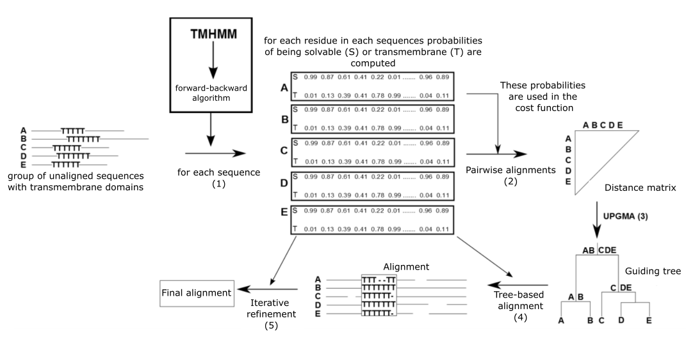
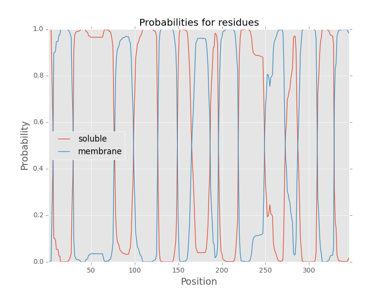
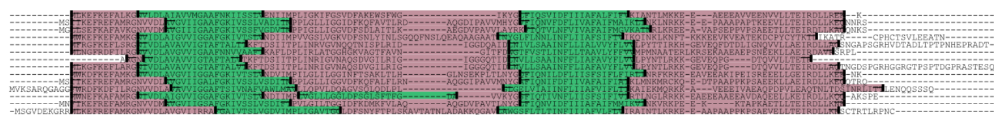

# AlignTMP

Java implementation of the multiple sequence alignment (MSA) algorithm for aligning proteins with transmembrane domains, called AlignTMP. Algorithm workflow is shown in the following figure:

## Algorithm 

Input is a set of protein sequences in "fasta" format. 

1. In the first step, sequences are analyzed using TMHMM (a hidden Markov model for predicting solvable and transmembrane regions in the input protein sequences) and a backward-forward algorithm. As a result, each residue in each sequence has two numbers that sum to one. These are probabilities of being either in a solvable (S) or transmembrane (T) domain. 
2. The computed probabilities are used in the next step of computing a distance matrix. All pairwise alignments (of every sequence with every other sequence) are computed. The alignment scores are used for building the distance matrix. 
3. In the next step, the distance matrix is used to compute a hierarchical clustering of the input sequences. This results in a guiding tree construction.
4. The constructed tree "guides" the alignment process. The most similar sequences (at the leaf nodes) are aligned together, which results in profiles. The computed profiles are merged together in a bigger profile. The whole procedure goes on until all profiles reach the root. 
5. Since this procedure is greedy, the final alignment might not be optimal. Therefore, extra steps are taken in a form of iterative refinement. If iterations do not improve the overall alignment score, the algorithm stops and returns the final alignment

## Examples

Computing solvable/transmembrane regions in a sequence using TMHMM and forward-backward algorithm:

Example of the alignment:

green color - transmembrane regions

## List of files

1. **DOCUMENTATION_AlignTMP.txt**

Detailed and thorough documentation of the program.

2. **AlignTMP_jar**

Folder with the jar file of AlignTMP program

3. **NewMatrix**

Folder with new 210 calculated substitution matrices (based on Pfam statistics) for all pairs of amino acids. Each file contains values for comparing pairs of residues with different parameters (probability to be in the membrane). For example, a line from the "AC.txt" file:

"AC	0.1	1.0	-23"

It means that if you want to align alanine with a parameter between 0.0-0.1 (probability of being membrane) and cysteine with a parameter between 0.9-1.0 you should use value -23 as a score of this pair.

4. **MEMBR_PFAM_397.txt**

List of Pfam domains, which were used for calculating new substitution matrices.

5. **MEMBR_PFAM_101.txt**

List of Pfam domains, which were not directly used for building new matrices.
(However, new data show that taking into account these domains does not change resulting values significantly). 